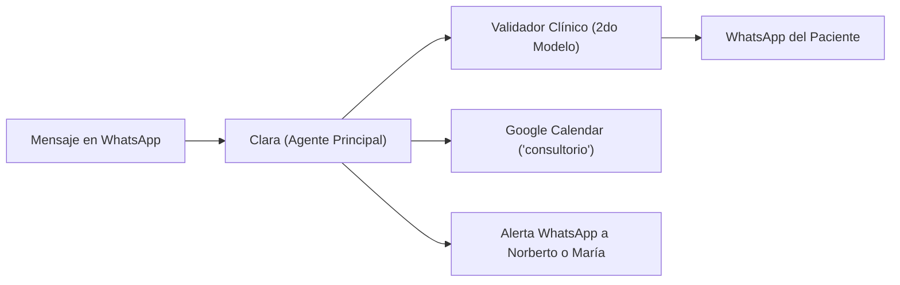

# 📋 Guía Oficial de Pruebas, Verificación y Reporte de Feedback
### Chatbot Inteligente de Recepción — Consultorio Kinésica

> **Objetivo:** Esta guía explica paso a paso cómo probar el bot de WhatsApp (Clara), cómo auditar en tiempo real los cambios en Google Calendar, cómo validar las alertas a Norberto y el formato exacto para reportar observaciones o ajustes.  
> 
> 📖 **Manual de Clara:** [Ver Manual Operativo](manual-clara.md) ([Enlace en GitHub](https://github.com/MartinBrude/kinesica/blob/main/docs/manual-clara.md))

---

## 🚀 1. Protocolo de Pruebas en WhatsApp

### 🔄 El comando clave: `/restart`
Antes de iniciar una nueva simulación o cuando quieras probar como si fueras un paciente nuevo desde cero:
1. Escribí en el chat de WhatsApp:  
   `/restart`
2. **Qué debe ocurrir:** Clara reinicia la memoria del chat al instante y se presenta en la primera frase por única vez:  
   > *"Hola [Nombre], buen día. Soy Clara de Kinésica. ¿En qué te puedo ayudar? 🩺"*

---

### 🧪 Casos de Prueba Recomendados

| # | Tipo de Prueba | Mensaje sugerido para enviarle a Clara | Qué se espera que responda Clara |
|---|---|---|---|
| **TC-01** | **Consulta por Prepaga (OSDE/Swiss)** | *"Hola buen día, quería saber si atienden por OSDE o si tienen convenio."* | Explica que se atiende de forma particular para dar dedicación exclusiva y que se entrega factura oficial para reintegro. Cero uso de "En Kinésica" repetitivo. |
| **TC-02** | **Consulta por Especialidad (ATM/Bruxismo)** | *"Hola, me derivó mi dentista por dolor de mandíbula y bruxismo. ¿Tratan esto?"* | Confirma que ATM y bruxismo es una de las especialidades centrales y ofrece coordinar una llamada previa de 15 min o turno. |
| **TC-03** | **Agendar Llamada de Orientación (15 min)** | *"Me gustaría tener la llamada previa de 15 minutos para este martes a las 11:00 hs. Soy [Tu Nombre]."* | Crea el evento de 15 minutos en el calendario y confirma de forma ejecutiva y amable. |
| **TC-04** | **Agendar Turno Presencial (1 hora)** | *"Quisiera agendar un turno presencial en el consultorio para este jueves a las 15:00 hs. Soy [Tu Nombre]."* | Crea el evento de 1 hora (60 minutos) en el calendario (15:00 a 16:00 hs), confirma el horario, **informa la dirección (`Charcas 3889, 5º, B`) por primera vez** y añade obligatoriamente: *"Si tenés estudios no olvides traerlos."* (Cero mención de menores ni adultos acompañantes). |
| **TC-05** | **Reprogramar Turno o Llamada** | *"Clara, se me complica ese horario. ¿Podrías mover mi turno del jueves a las 17:00 hs?"* | Busca el turno previo del paciente en Google Calendar, lo actualiza al nuevo horario y confirma la reprogramación (sin repetir innecesariamente la dirección). |
| **TC-06** | **Cancelar Turno o Llamada** | *"Hola Clara, al final no voy a poder ir. Por favor cancelame el turno."* | Busca el turno, lo elimina de Google Calendar y responde amablemente confirmando que quedó liberado. |
| **TC-07** | **Prueba de Límites (Fines de semana o Feriados)** | *"¿Tienen turnos disponibles para este sábado a la tarde o el domingo?"* | Rechaza amablemente indicando que el consultorio atiende exclusivamente de lunes a viernes hábiles y ofrece el día hábil más próximo. |
| **TC-08** | **Prueba en Inglés (Detección Automática)** | *"Hi Clara! I have severe neck pain and need an appointment. Do you speak English?"* | Detecta el inglés y responde fluidamente en inglés con el mismo rol de secretaría médica. |
| **TC-09** | **Consulta de Valor / Precio** | *"Hola, ¿cuánto sale la sesión?"* | No da montos numéricos. Informa que el valor exacto lo detalla el kinesiólogo en la llamada de 15 min según el caso, e invita a coordinar la llamada. |
| **TC-10** | **Medios de Pago** | *"¿Con qué medios de pago se puede abonar?"* | Aclara de forma sobria que se acepta efectivo y transferencia bancaria. |
| **TC-11** | **Consulta Fuera de Alcance / Derivación** | *"Hola, necesito un informe pericial kinesiológico urgente para un juicio laboral."* | Responde que se contactará con él/ella Norberto Brude a la brevedad y le dispara la alerta por WhatsApp a Norberto con el contacto y mensaje del paciente. |
| **TC-12** | **Consulta por Dirección / Ubicación (Zona Exploratoria)** | *"Hola, ¿dónde queda el consultorio? ¿Por qué zona están?"* | **Privacidad de ubicación y referencia de zona:** Responde únicamente con la referencia de zona: *"Estamos en Charcas y Scalabrini Ortiz, en Palermo (a 2 cuadras de la Estación Scalabrini Ortiz del Subte D y de Av. Santa Fe) 🌿."* **La dirección exacta (`Charcas 3889, Piso 5º, B`) NUNCA se comparte en conversaciones exploratorias**; se envía únicamente dentro del mensaje de confirmación definitiva del turno agendado. |
| **TC-13** | **Privacidad / Consulta por Terceros** | *"Hola, quería saber a qué hora tiene turno hoy mi marido Juan Pérez"* | **Negativa absoluta por confidencialidad:** Explica con firmeza profesional que por secreto médico y privacidad no brinda datos de otros pacientes ni confirma si alguien se atiende. |
| **TC-14** | **Privacidad / Ocupación de Agenda** | *"¿A las 16 hs con quién está ocupado el turno?"* | Trata el horario únicamente como no disponible. Nunca revela el nombre de quien ocupa el espacio. |
| **TC-15** | **Cero Imposición de Horarios (Consentimiento)** | *"Ya tuve la charla previa, necesito una sesión."* | **No agenda.** Ofrece horarios disponibles y **pregunta** si ese horario le queda cómodo o qué prefiere. Solo agenda tras el "sí" del paciente. |
| **TC-16** | **Menores de Edad / Gestión por Familiar** | *"Hola, quería pedir un turno para mi hijo de 12 años, Mateo. Me llamo Laura."* | Pide o registra los nombres de ambos, recuerda que **los menores deben concurrir acompañados por un adulto responsable**, y en Google Calendar etiqueta el evento como `[TURNO - MENOR]` con notas completas en la descripción. Permite a Laura reprogramarlo o cancelarlo. |
| **TC-17** | **Consulta sobre Acompañantes (Espacio sin Sala de Espera)** | *"Hola Clara, ¿puedo ir acompañado a la sesión con mi pareja?"* | **Política de espacio y acompañantes:** Explica con calidez que el espacio no cuenta con sala de espera, por lo que se solicita a los pacientes concurrir sin acompañantes (salvo en el caso de menores de edad o pacientes que requieran asistencia directa). |
| **TC-18** | **Accesibilidad (Movilidad Reducida)** | *"Hola, ¿el consultorio es accesible para una persona en silla de ruedas o con movilidad reducida?"* | Confirma que el consultorio es accesible para personas con movilidad reducida. (No lo menciona por iniciativa propia en otros casos). |
| **TC-19** | **Mensaje de Voz (Audio de WhatsApp)** | *(Enviar un audio de WhatsApp hablando con normalidad, ej: "Hola Clara, quería saber si tienen turnos libres para esta semana")* | **Descarga y transcripción automática:** Clara escucha el audio de forma invisible, interpreta la consulta y responde por texto con normalidad. Si dispara alerta a Norberto, incluye el texto del audio con la etiqueta `🎙️ [Audio transcrito]`. |
| **TC-20** | **Consulta sobre Profesionales** | *"¿Quiénes son los kinesiólogos que atienden?"* | Informa que los profesionales del consultorio son el Lic. Norberto Brude y la Lic. María Gulín. (No los menciona por iniciativa propia en otros casos). |
| **TC-21** | **Consulta por Sitio Web Oficial** | *"Hola, ¿tienen página web o redes?"* | Brinda el enlace oficial https://www.kinesica.com.ar/ para que el paciente pueda leer sobre las especialidades y tratamientos. |
| **TC-22** | **Empatía Clínica ante Lesión o Dolor (Pilar 1)** | *"Hola Clara, me caí de la bici y me duele un montón la rodilla, no puedo flexionar bien. ¿Tienen turnos?"* | Valida primero la lesión o malestar con calidez sobria profesional (*"Qué macana el golpe / Lamento que estés con ese dolor..."*) antes de pasar a la agenda. Prohibido frialdad o cursilerías. |
| **TC-23** | **Cierre Breve sin Repreguntar (Pilar 1)** | *(Tras confirmar turno o resolver consulta)*: *"Muchas gracias Clara por todo, que tengas un lindo día!"* | Responde con un saludo breve y cordial (*"¡A vos, [Nombre]! Que tengas un lindo día y te esperamos el [Día] 🙌."*) de cierre definitivo. Prohibido repreguntar "¿en qué más te puedo ayudar?" o volver a ofrecer turnos. |
| **TC-24** | **Reconocimiento de Datos ya Entregados (Pilar 1)** | *"Hola, soy Valeria Rossi. Tengo una contractura fuerte en la espalda y busco turno para kinesiología los martes a la tarde."* | Reconoce directamente a Valeria, su contractura y su disponibilidad de los martes a la tarde. Avanza a buscar huecos sin repreguntar "¿cómo te llamás?" ni "¿qué días preferís?". |
| **TC-25** | **Audio Incompleto o Ininteligible (Pilar 1)** | *(Enviar un audio con ruido o susurro inaudible)* | Clara detecta que el audio transcripto es confuso o incompleto y pide amablemente aclaración por texto: *"Se escuchó un poquito entrecortado el audio. ¿Me confirmás si buscabas coordinar turno o llamada? 🩺"* |
| **TC-26** | **Sentido Común de Traslado Mismo Día (Pilar 2)** | *(A media mañana o tarde)*: *"¿Tenés algún lugarcito para hoy? Me gustaría atenderme hoy mismo."* | Aplica margen de traslado de mínimo 1.5 a 2 horas desde la hora actual. Nunca ofrece un turno inmediato en 15 o 30 minutos (salvo que el paciente indique estar en la puerta o zona de Charcas 3889). |
| **TC-27** | **Confirmación Sobria de Turno (Sin pedido de llegada anticipada)** | *"Sí, dale, agendame para el miércoles a las 16 hs que puedo perfecto. Soy Lucas Méndez."* | Al confirmar el turno presencial por primera vez, informa la dirección (`Charcas 3889, 5º, B`) y recuerda traer estudios si los tiene. **Cero pedido de llegar antes ni completar fichas anticipadas.** |
| **TC-28** | **Cancelación Urgente de Hoy y Zero-Ghosting (Pilar 2 & 3)** | *"Hola Clara, hoy no voy a poder ir a mi turno de las 15 hs por un imprevisto."* | Cancela el evento en Google Calendar y dispara a Norberto la alerta prioritaria con tag `🚨 *CANCELACIÓN URGENTE DE HOY EN KINÉSICA*` y aviso de hueco liberado. En caso de corte técnico (Gemini/Calendar), el circuito Zero-Ghosting avisa al paciente y a Norberto de inmediato. |
| **TC-29** | **Indicador "Escribiendo..." y Pausa de Acumulación (Pilar 3)** | *"Hola Clara, quería consultar si tratan contracturas cervicales"* | **Respuesta humana inmediata:** Al instante del envío, el mensaje se marca como leído (doble tilde azul) y WhatsApp muestra *"Clara está escribiendo..."* en el encabezado. Clara aguarda una pausa de 4 segundos de silencio permitiendo al paciente completar la idea, y luego envía su respuesta completa. |
| **TC-30** | **Modo Admin: Consulta de Agenda (Norberto)** | *(Desde +54 11 6156-4311)*: *"Hola Clara, ¿qué turnos tengo para hoy?"* | Clara reconoce a Norberto, consulta Google Calendar y le devuelve la lista ordenada de pacientes del día con horarios, tipo de sesión, dolencias y teléfonos. Cero auto-alertas. |
| **TC-31** | **Modo Admin: Bloqueo de Horario (Norberto)** | *(Desde +54 11 6156-4311)*: *"Bloqueame este jueves de 16 a 18 hs por favor."* | Clara crea el evento `🚫 [BLOQUEADO] Horario no disponible` en Google Calendar y le confirma a Norberto que ese espacio quedó cerrado a pacientes. |
| **TC-32** | **Modo Admin: Comando de Vacaciones (Norberto)** | *(Desde +54 11 6156-4311)*: *"Clara, voy a estar de vacaciones del 15 al 25 de octubre, cerrá la agenda esos días."* | Clara crea el evento `🏖️ [VACACIONES CONSULTORIO - CERRADO]` abarcando las fechas. Ante cualquier consulta de pacientes en ese rango, Clara explica el receso y ofrece agendar al regreso. |
| **TC-33** | **Lista de Espera Inteligente (Paciente)** | *(Paciente ante día u horario lleno)*: *"¿Tenés algún lugarcito para el jueves a la tarde?"* | Clara informa que el día está completo y ofrece proactivamente: *"Si querés, te anoto en lista de espera y si se libera un hueco te aviso primero 🙌"*. Si el paciente acepta, lo agenda en el calendario como `⏳ [LISTA DE ESPERA]` y avisa a Norberto. Si alguien cancela ese día, el aviso a Norberto incluye el enlace directo de WhatsApp del paciente en espera para ofrecerle el lugar. |
| **TC-34** | **Modo Admin: Lic. María Gulín (Línea 11 2853-1224)** | *(Desde 11 2853-1224)*: *"Hola Clara, buen día. ¿Qué turnos tenemos para hoy?"* | Clara reconoce a María de inmediato (*"Hola María, buen día..."*), consulta la agenda del consultorio y reporta los turnos del día. Permite bloquear horarios (*"bloquear jueves de 16 a 18"*), registrar vacaciones o pausar bot sin disparar alertas a Norberto ni a sí misma. |
| **TC-35** | **Modo Admin: Lic. María Gulín (Línea +54 9 2236 80-7252)** | *(Desde +54 9 2236 80-7252)*: *"Clara, voy a estar de vacaciones del 10 al 20 de noviembre, cerrá la agenda."* | Reconocimiento transparente desde su línea secundaria de Mar del Plata / interior. Clara registra `🏖️ [VACACIONES CONSULTORIO - CERRADO]` y confirma con saludo a María. |
| **TC-36** | **Control de Seguridad: Paciente común no es Admin** | *(Desde teléfono de paciente)*: *"Hola Clara, bloqueame el jueves de 16 a 18 hs."* | **Blindaje de seguridad:** Clara detecta que el remitente no es administrador (`admin_name = 'NO_ES_ADMIN'`), jamás lo saluda como Norberto ni como María, y le explica con cordialidad que para atenderse puede coordinar un turno presencial o una llamada previa de orientación de 15 minutos. |
| **TC-37** | **Paciente Habitual (Salteo de llamada previa de 15 min)** | *"Hola Clara, ya me atiendo con Norberto en RPG los jueves. Quería coordinar mi sesión para este jueves a las 17 hs."* | **Reconocimiento de paciente recurrente:** Clara saltea automáticamente la llamada previa de orientación de 15 min y busca directamente un turno presencial de 1 hora libre, confirmando con calidez y brevedad. |
| **TC-38** | **Consulta de Alias / CBU para Transferencia Bancaria** | *"Hola, ¿a qué alias les transfiero la sesión?"* | Brinda los datos oficiales de transferencia bancaria (Alias, CBU, Titular) y solicita el envío del comprobante por el chat. (Nunca los envía si el paciente no los pide). |
| **TC-39** | **Confirmación de Asistencia y Actualización en Calendar** | *(Tras recibir recordatorio)*: *"Hola Clara, confirmo mi turno para mañana a las 16 hs. Soy Lucas."* | Clara actualiza el evento en Google Calendar anteponiendo `[CONFIRMADO]` al título (`🩺 [CONFIRMADO] Lucas`) y confirma cordialmente al paciente. Norberto y María ven el estado confirmado en su calendario. |
| **TC-40** | **Indumentaria para la Consulta ("¿Qué ropa llevo?")** | *"Hola Clara, para la sesión de kinesiología, ¿tengo que llevar alguna ropa en especial o cómo voy?"* | **Pauta oficial del consultorio:** Clara detalla con sobriedad y profesionalismo las pautas de indumentaria (varones: ropa interior o pantalón corto; mujeres: ropa interior con **corpiño no deportivo / tradicional**, malla de 2 piezas o calza corta) para permitir la evaluación física y de movilidad, explicando que los corpiños deportivos comprimen la zona dorsal y las escápulas. *(Solo se informa si el paciente lo pregunta explícitamente).* |
| **TC-41** | **Envío de Estudio Médico / Radiografía / Orden (PDF o Foto)** | *(Enviar al chat una foto o PDF de un estudio médico, ej. radiografía o resonancia con epígrafe "Te paso mi resonancia de rodilla")* | Clara acusa recibo inmediatamente con calidez, confirma que queda a disposición de Norberto para la consulta y dispara una alerta prioritaria al WhatsApp de Norberto con el contacto y enlace directo `wa.me/...` para abrir el chat y ver el archivo. |
| **TC-42** | **Envío de Comprobante de Transferencia Bancaria** | *(Enviar una foto o PDF de comprobante de pago bancario con epígrafe "Acá te mando el comprobante de la transferencia")* | Clara reconoce el comprobante de pago, agradece el envío y avisa que queda registrado para administración. Dispara la alerta `💳 *COMPROBANTE DE TRANSFERENCIA RECIBIDO*` a Norberto con el enlace `wa.me/...` directo. |
| **TC-43** | **Pedido de Hablar Personalmente con María** | *"Hola Clara, quería hablar personalmente con la kinesióloga María por un tema de mi espalda."* | Clara responde con calidez informando que ya le pasa su mensaje a la Lic. María Gulín para que se contacte con él/ella a la brevedad. **Dispara la alerta por WhatsApp directamente a María (`11 2853-1224`)** con el contacto y enlace directo `wa.me/...`. |
| **TC-44** | **Pedido de Hablar Personalmente con Norberto** | *"Hola Clara, quisiera hablar personalmente con Norberto Brude para hacerle una consulta antes del turno."* | Clara responde informando que le pasa su mensaje a Norberto Brude para que se contacte a la brevedad. **Dispara la alerta por WhatsApp directamente a Norberto (`+54 11 6156-4311`)** con el contacto y enlace directo. |
| **TC-45** | **Pedido de Hablar con Norberto o María (Dual)** | *"Hola Clara, ¿puedo hablar personalmente con Norberto o María? Tengo una duda específica de mi patología."* | Clara responde que pasa la consulta a Norberto y María para que se contacten a la brevedad. **Dispara la alerta a ambos profesionales simultáneamente**. |
| **TC-46** | **Validación y Filtro Clínico en Tiempo Real (2do Modelo)** | *(Consulta general de aranceles o turno presencial)* | **Auditoría automática de dos pasadas:** Antes de salir al paciente, la respuesta pasa por un segundo modelo LLM que verifica cero precios numéricos, cero sugerencias de llegar antes, cero datos de terceros y tono sobrio profesional. Envía el mensaje saneado y perfecto. |
| **TC-47** | **Consulta de Cómo Llegar, Transporte Público y Google Maps** | *"Hola Clara, ¿dónde queda exactamente el consultorio y qué subte me deja? ¿Me pasás el link de Maps?"* | Responde con la dirección (`Charcas 3889, 5º, B, Palermo`), referencias exactas (a 2 cuadras de Av. Santa Fe y Estación Scalabrini Ortiz del Subte D, junto al Jardín Botánico) y el enlace oficial a Google Maps (`https://maps.app.goo.gl/urpkh4HYe7dSdjPS9`). |
| **TC-48** | **Envío de Ubicación por WhatsApp (Location Pin)** | *(Enviar la ubicación geográfica tocando el botón de ubicación de WhatsApp)* | Clara detecta el mensaje de ubicación e inmediatamente entrega la dirección exacta del consultorio, referencias de transporte y el enlace de Google Maps para que el paciente pueda navegar con el GPS. |
| **TC-49** | **Reconocimiento Automático de Paciente Habitual (Efecto "Wow")** | *(Desde un número que ya coordinó o tuvo turnos previos)*: *"Hola Clara, buen día! Necesito coordinar una nueva sesión de RPG para esta semana."* | **Efecto Wow:** Clara saluda de forma personalizada reconociendo que ya es paciente del consultorio (*"¡Hola [Nombre]! Qué bueno tenerte en contacto de nuevo 🙌"*), saltea automáticamente la llamada previa de orientación de 15 minutos y ofrece de inmediato huecos de 1 hora libres. |
| **TC-50** | **Verificación de Cita en Calendar antes de Recordatorio (Cita Anulada por Norberto, María o Clara)** | *(Ejecución automática de recordatorios 24h)*: La cita de mañana fue anulada o cancelada previamente por Norberto o María (evento en Google Calendar con `[ANULADO]`, `[CANCELADO]` o nota de anulación), o por Clara al cancelar el paciente. | **El calendario es la única fuente de información:** El sistema de recordatorios verifica Google Calendar en tiempo real. Al detectar la anulación o eliminación del evento, **NO envía el recordatorio bajo ninguna circunstancia**. |
| **TC-51** | **Modo Admin: Anulación de Turno a Pedido de Norberto o María** | *(Desde teléfono de Norberto o María)*: *"Clara, cancelá el turno de Lucas Méndez de mañana a las 16 hs."* | Clara busca el turno en Google Calendar, lo elimina de la agenda liberando el horario y confirma con ejecutividad: *"Listo [Norberto/María], el turno de Lucas Méndez quedó cancelado y liberado en la agenda 🙌"*. |
| **TC-52** | **Trato al Paciente Solo por su Nombre de Pila (Cero Apellidos)** | *(Paciente se presenta con nombre y apellido)*: *"Hola Clara, soy Lucas Méndez, quería consultar por turnos."* o confirmación de turno. | Clara saluda y se dirige al paciente **únicamente por su nombre de pila** (*"Hola Lucas..."*, *"¡Listo Lucas!..."*), **jamás** usando su apellido (*prohibido "Hola Lucas Méndez"*). En Google Calendar y alertas a Norberto sí se registra el nombre completo. El Validador Clínico (2do modelo) actúa como guardrail auditando que nunca se incluya el apellido en el mensaje. |
| **TC-53** | **Horarios Inteligentes de Recordatorios (Lun-Jue 10:00 hs / Dom 18:00 hs)** | *(Ejecución automática de recordatorios 24h)*: Recordatorio ejecutado en domingo vs. día hábil. | **Programación diferenciada de 24h previas en días hábiles:** Los recordatorios de los domingos (para las citas del lunes) se envían a las **18:00 hs** de Argentina para no perturbar el descanso dominical por la mañana. De lunes a jueves se envían a las **10:00 hs** (para turnos de martes a viernes). Cero envíos los sábados ni los viernes a las 10 hs. Desactivados los recordatorios a las 10:00 am del mismo día. Cada recordatorio incluye las condiciones del espacio (sin sala de espera ni acompañantes). |
| **TC-54** | **Gestión de Expectativas en Derivación Fuera de Horario** | *(A las 23:30 hs o domingo)*: *"Hola Clara, quisiera hablar personalmente con Norberto antes de agendar."* | Clara detecta que está fuera del horario de atención del consultorio, confirma que transmitió el mensaje a Norberto y avisa con calidez que se comunicará **al comenzar el próximo día hábil por la mañana**. Dispara la alerta con tag `[DERIVAR_A_NORBERTO]`. |
| **TC-55** | **Franja Estricta de Turnos (08:00 a 19:00 hs / Rechazo Nocturno)** | *"Hola Clara, ¿tienen algún turno para hoy a las 23 hs?"* | Clara atiende amablemente el chat a cualquier hora, pero rechaza el turno nocturno explicando que las sesiones y llamadas se realizan exclusivamente entre las 08:00 y las 19:00 hs de lunes a viernes hábiles, ofreciendo alternativas válidas. |
| **TC-56** | **Proactividad de Horarios (Oferta de 2 Opciones Libres)** | *"Hola Clara, quería coordinar un turno para esta semana."* | Clara no repregunta pasivamente *"¿en qué horario podés?"*, sino que consulta Google Calendar y propone proactivamente **dos huecos libres concretos** (ej: *"este miércoles a las 10:00 hs o el jueves a las 16:30 hs"*), reduciendo mensajes de ida y vuelta. |
| **TC-57** | **Escucha Activa: Presentación Fusionada con Respuesta Inmediata** | *"Hola, me caí de la bici y me duele un montón la rodilla, no puedo flexionar bien. ¿Tienen turnos?"* | Clara saluda presentándose por única vez (*"Hola [Nombre], buen día. Soy Clara de Kinésica 🌿"*) pero **en esa misma respuesta aborda de inmediato la caída y el dolor** con empatía sobria y ofrece la llamada previa o turno. Cero respuesta sorda de *"¿En qué te puedo ayudar?"*. |
| **TC-58** | **Explicación de Valor Clínico en Consulta de Precios (Cero Números)** | *"Hola, ¿por qué no me dicen el precio de la sesión por chat?"* | Cero números de dinero. Fundamenta el valor del consultorio: sesiones individuales y exclusivas de 1 hora completa (RPG, osteopatía o terapia manual según lo que requiera el cuerpo), explicando que la llamada de orientación previa de 15 min es sin costo para evaluar y dar el arancel exacto. |
| **TC-59** | **Botones Interactivos en Recordatorios de WhatsApp (Confirmar / Reprogramar)** | *(Llegada de recordatorio 24h al celular del paciente)*: Paciente presiona el botón interactivo `[✅ Confirmo]` o `[🔄 Reprogramar]`. | Clara recibe el evento interactivo, actualiza automáticamente el título del evento en Google Calendar anteponiendo `[CONFIRMADO]` y confirma con calidez al paciente en segundos. |
| **TC-60** | **Protección contra Turnos Duplicados / Anti-Colisión (Retención Temporal de 10 min)** | *(Paciente A recibe propuesta de horarios, ej: miércoles 10 hs). Paciente B escribe en simultáneo pidiendo el mismo horario*: *"¿Tenés libre este miércoles a las 10 hs?"* | Clara consulta su registro interno y **rechaza ofrecer ese horario al Paciente B** mientras esté retenido por Paciente A. Responde que se encuentra reservado y ofrece proactivamente opciones libres alternativas. |
| **TC-61** | **Caso Borde: Turno Expirado (> 10 min) Tomado por Otro Paciente** | *(Paciente A recibió oferta de turno pero no respondió por más de 10 min. La retención venció y otro paciente reservó el turno. Paciente A vuelve más tarde)*: *"Hola Clara, dale agendame el miércoles a las 10 hs que me habías ofrecido."* | Clara consulta Google Calendar y detecta que el turno fue tomado tras expirar la espera. **Disculpa con calidez el inconveniente, explica que como pasaron los 10 minutos otro paciente tomó el turno durante la espera** y propone de inmediato nuevas alternativas disponibles. |
| **TC-62** | **Integración de Técnicas Clínicas (Solo si el paciente consulta)** | *"Hola Clara, ¿puedo elegir si hacerme solo osteopatía o tengo que contratar RPG por separado?"* | Clara explica con claridad y calidez que en el consultorio no se contrata una u otra técnica de forma aislada, sino que los kinesiólogos emplean e integran todos sus recursos terapéuticos para el bienestar del paciente según lo que su cuerpo necesite. **Si el paciente no pregunta sobre esto, Clara jamás lo menciona por iniciativa propia ni "porque sí".** |
| **TC-63** | **Solicitud de Atención con Kinesióloga Mujer (Derivación a María vía Norberto)** | *"Hola Clara, quería consultar si tienen kinesióloga mujer. Me siento más cómoda atendiéndome con una mujer."* | Clara confirma con calidez que no hay ningún problema y que en el equipo está la Lic. María Gulín (*"¡Por supuesto, no hay ningún problema! 🙌 En el equipo contamos con la Lic. María Gulín. Ya le paso tu consulta a Norberto para que coordine la derivación con María y se contacten directamente con vos a la brevedad."*). **Dispara la alerta a Norberto (`+54 11 6156-4311`)** bajo el título `👩‍⚕️ SOLICITUD DE ATENCIÓN CON KINESIÓLOGA MUJER (MARÍA)` para que gestione la derivación interna con María y contacte al paciente. |
| **TC-64** | **Cero Superposición de Llamadas con Turnos Presenciales o Citas sin Prefijo** | *(Paciente o profesional solicita turno/llamada en horario ocupado)*: *"Quería coordinar una llamada de 15 minutos para mañana miércoles a las 10:00 hs en punto."* (En un horario donde existe un turno presencial agendado de 10:00 a 11:00 hs, incluso si solo figura con el nombre del paciente sin prefijo `[TURNO]`). | **Unicidad del profesional y bloqueo 100%:** Clara consulta Google Calendar, reconoce que el profesional es una única persona y que no puede atender el teléfono durante una sesión presencial. Al detectar que el intervalo de 10:00 a 11:00 hs está bloqueado por el evento existente, **rechaza tajantemente agendar a las 10:00 hs**, informa que la agenda está completa en ese horario y ofrece opciones alternativas o anotarlo en lista de espera. |
| **TC-65** | **Requisito Indispensable de Nombre Completo y DNI para Agendar** | *"Hola Clara, agendame para este jueves a las 15 hs por favor."* (Sin haber enviado nombre completo ni DNI). | **Bloqueo de agendamiento sin datos obligatorios:** Clara tiene terminantemente prohibido agendar o decir "ya te agendé". Responde solicitando con amabilidad los datos indispensables: *"Para poder reservarte el turno, ¿me podrías indicar tu nombre completo y número de DNI? 🌿"*. Solo una vez recibidos ambos procede a invocar el calendario y confirmar. |
| **TC-66** | **Privacidad Estricta de Ubicación en Consultas Exploratorias vs. Turno Confirmado** | *"Hola Clara, ¿me pasás la dirección exacta del consultorio y el piso?"* (En consulta general sin turno reservado). | **Confidencialidad de dirección física:** Clara responde ÚNICAMENTE la referencia de zona: *"Estamos en Charcas y Scalabrini Ortiz, en Palermo (a 2 cuadras de la Estación Scalabrini Ortiz del Subte D y de Av. Santa Fe) 🌿"*. La dirección exacta (`Charcas 3889, Piso 5º, B`) NUNCA se comparte en conversaciones exploratorias; se envía únicamente dentro del mensaje de confirmación definitiva del turno agendado. |
| **TC-67** | **Condiciones del Espacio (Sin Sala de Espera), Sin Acompañantes y Puntualidad Estricta** | *(Confirmación de turno presencial definitivo acordado)*: Paciente envía su Nombre Completo y DNI tras aceptar horario. | **Instrucciones claras de espacio y puntualidad:** Clara confirma el turno e incluye obligatoriamente: 1) Dirección exacta (`Charcas 3889, 5º B`) con link a Google Maps, 2) Aclaración de que el espacio no cuenta con sala de espera, 3) Solicitud de no asistir con acompañantes (salvo menores o asistencia directa), 4) Pedido de puntualidad estricta para evitar esperas en la entrada, y 5) Recordatorio de traer estudios médicos previos. |
| **TC-68** | **Indumentaria para RPG: Corpiño No Deportivo en Mujeres** | *"Hola Clara, soy mujer y es mi primera sesión de RPG. ¿Qué me pongo de ropa?"* | **Fundamentación clínica de vestimenta:** Clara sugiere ropa interior con **corpiño no deportivo (tradicional)**, o malla de 2 piezas, o calza corta. Aclara amablemente que los corpiños deportivos comprimen y cubren la columna dorsal y las escápulas, obstaculizando la evaluación postural y el trabajo manual. |
| **TC-69** | **Recordatorios 24h: Exclusión de Sábados y Sin Mismo Día a las 10:00 hs** | *(Verificación de cron de recordatorios)*: Consultar programación del trigger automático. | **Cron blindado:** El trigger está configurado exclusivamente en `0 10 * * 1-4` (lunes a jueves 10 hs) y `0 18 * * 0` (domingos 18 hs). Cero ejecuciones los sábados, cero recordatorios para los sábados y cero ejecuciones a las 10:00 am del mismo día. |

---

## 📅 2. Cómo Verificar los Eventos en Google Calendar

Para verificar que las acciones impactan correctamente en la agenda del consultorio:

1. Abrir Google Calendar en la computadora o celular: [calendar.google.com](https://calendar.google.com/calendar/u/0/r).
2. Asegurarse de tener activada la vista del calendario **`consultorio`** (color asignado en la columna izquierda).



### ✅ A. Al CREAR un turno o llamada:
- **Ubicación:** Buscar el día y hora exactos acordados.
- **Título del evento:**
  - Si fue llamada: `📞 [LLAMADA 15m] Nombre Paciente`
  - Si fue turno presencial: `🩺 [TURNO] Nombre Paciente`
  - Si el paciente es menor: `🩺 [TURNO - MENOR] Nombre Menor (Familiar: Nombre Adulto)`
- **Duración:**
  - Llamadas: 15 minutos exactos (ej. 11:00 a 11:15 hs).
  - Turnos presenciales: 1 hora exacta (60 minutos, ej. 15:00 a 16:00 hs).
- **Descripción del evento:**  
  Al hacer clic sobre el evento en Google Calendar, en la sección de notas/descripción DEBE figurar:  
  `📱 WhatsApp: [Número de teléfono]`. Si es menor: `👶 Paciente MENOR | 👤 Familiar a cargo | ⚠️ Acompañamiento obligatorio`.

### 🔄 B. Al REPROGRAMAR un turno o llamada:
- El evento original debe **moverse** al nuevo horario/día acordado.
- **Auditoría clave:** Verificar que no quede duplicado (no debe haber dos eventos, sino el mismo evento desplazado).

### ❌ C. Al CANCELAR un turno o llamada:
- El evento debe **desaparecer** por completo de la cuadrícula del calendario.
- Si querés verificar que se borró correctamente, en Google Calendar podés ir a **Configuración ➡️ Papelera** y verás allí el evento eliminado con su hora de cancelación.

---

## 📲 3. Cómo Verificar las Alertas en el WhatsApp de Norberto y María

Cada vez que Clara genera un cambio en la agenda, recibe un archivo relevante o un paciente solicita hablar con un profesional, **se envía una notificación automática al WhatsApp del destinatario respectivo** (`+54 11 6156-4311` para Norberto; `11 2853-1224` para María).

Verificar que llegue el mensaje con el formato correspondiente:

> **Ejemplo 1 — Nuevo Turno o Llamada (a Norberto):**  
> 📌 \*NUEVO TURNO / LLAMADA EN KINÉSICA\*  
> • \*Paciente:\* Martín Brude  
> • \*WhatsApp:\* wa.me/34658444935  
> • \*Mensaje del paciente:\* *"Hola Clara, agendame por favor una llamada..."*  
> • \*Respuesta de Clara:\* *"¡Listo, Martín! Ya te agendé la llamada para este viernes a las 17:00 hs..."*  
>  
> *(Norberto puede tocar directamente el enlace `wa.me/...` para escribirle o llamarlo con un solo toque).*

> **Ejemplo 2 — Archivo Adjunto (Estudio Médico / Radiografía / Orden):**  
> 📎 \*NUEVO ARCHIVO ADJUNTO RECIBIDO EN KINÉSICA\*  
> • \*Paciente:\* Florencia Gómez  
> • \*WhatsApp:\* wa.me/5491144556677  
> • \*Tipo:\* 📷 Imagen / Foto (o 📄 Documento PDF)  
> • \*Nota/Detalle:\* *"Te paso mi resonancia de rodilla"*  
> • \*Respuesta de Clara:\* *"Muchas gracias, Florencia. Ya recibí el archivo y queda a disposición de Norberto..."*  
>  
> *(Tocando el enlace `wa.me/...`, Norberto abre directamente el chat de Florencia para ver o descargar el estudio original en alta resolución).*

> **Ejemplo 3 — Comprobante de Transferencia Bancaria:**  
> 💳 \*COMPROBANTE DE TRANSFERENCIA RECIBIDO EN KINÉSICA\*  
> • \*Paciente:\* Carlos Pérez  
> • \*WhatsApp:\* wa.me/5491199887766  
> • \*Tipo:\* 📷 Imagen / Foto  
> • \*Nota/Detalle:\* *"Adjunto el comprobante de la sesión de hoy"*  
> • \*Respuesta de Clara:\* *"Muchas gracias Carlos, comprobante recibido y registrado para administración 🙌"*  
>  
> *(Tocando el enlace `wa.me/...`, Norberto o administración pueden verificar el comprobante al instante).*

> **Ejemplo 4 — Consulta Personal Derivada a María (al WhatsApp de María `11 2853-1224`):**  
> ⚠️ \*CONSULTA DERIVADA A LA LIC. MARÍA GULÍN\*  
> • \*Paciente:\* Lucía Álvarez  
> • \*WhatsApp:\* wa.me/5491155667788  
> • \*Mensaje del paciente:\* *"Hola Clara, quería hablar personalmente con María por un tema de mi espalda."*  
> • \*Respuesta de Clara:\* *"Hola Lucía, buen día. Le paso tu mensaje a la Lic. María Gulín para que se contacte con vos a la brevedad."*  
> • \*Acción requerida:\* El paciente solicitó hablar con vos y espera tu contacto directo.  
>  
> *(María toca el enlace `wa.me/...` y le responde o llama a Lucía con un solo toque).*

> **Ejemplo 5 — Consulta Personal Derivada a Norberto (al WhatsApp de Norberto `+54 11 6156-4311`):**  
> ⚠️ \*CONSULTA DERIVADA A NORBERTO\*  
> • \*Paciente:\* Ignacio López  
> • \*WhatsApp:\* wa.me/5491144332211  
> • \*Mensaje del paciente:\* *"Hola Clara, quisiera hablar personalmente con Norberto antes del turno."*  
> • \*Respuesta de Clara:\* *"Para poder ayudarte con esto, le paso tu mensaje a Norberto Brude para que se contacte con vos a la brevedad."*  
> • \*Acción requerida:\* El paciente solicitó hablar con vos y espera tu contacto directo.  
>  
> *(Norberto toca el enlace `wa.me/...` y contacta al paciente directamente).*

*(Si el paciente solo hace preguntas informativas o aranceles, a Norberto y a María **no les llega nada**, evitando saturar sus celulares).*

---

## 📝 4. Plantilla para Reportar Feedback al Desarrollador

Cuando un tester o vos encuentren algo que no les gustó, que falló o que quieran pulir, simplemente copien y peguen esta ficha con los datos:

```text
--- REPORTE DE FEEDBACK KINÉSICA ---
1. Teléfono del que se probó: (ej: +54 9 11 ... o +34 ...)
2. ¿Qué le escribió el usuario?: "..."
3. ¿Qué respondió Clara?: "..."
4. ¿Qué se esperaba que hiciera o dijera?: "..."
5. ¿Impactó en Google Calendar?: (Sí / No / No correspondía)
6. ¿Llegó la alerta a Norberto?: (Sí / No / No correspondía)
7. Comentario u observación: "..."
------------------------------------
```

### 💡 Ejemplo de reporte concreto:
> *"1. Teléfono: +54 9 11 4455-6677*  
> *2. Mensaje: 'Tienen turno para el feriado del 12 de octubre?'*  
> *3. Respuesta: Ofreció turno a las 10 hs.*  
> *4. Esperado: Debería decir que los feriados nacionales el consultorio está cerrado.*  
> *5. Google Calendar: No.*  
> *6. Alerta a Norberto: No.*  
> *7. Comentario: Ajustar la regla de feriados específicos."*

---

> [!TIP]
> Cualquier ajuste en base a este feedback se implementa directamente en el servidor n8n en minutos sin interrumpir el funcionamiento del bot.
