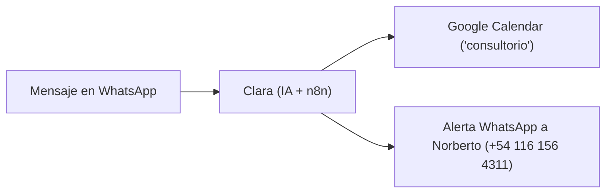

# 📋 Guía Oficial de Pruebas, Verificación y Reporte de Feedback
### Chatbot Inteligente de Recepción — Consultorio Kinésica

> **Objetivo:** Esta guía explica paso a paso cómo probar el bot de WhatsApp (Clara), cómo auditar en tiempo real los cambios en Google Calendar, cómo validar las alertas a Norberto y el formato exacto para reportar observaciones o ajustes.  
> 
> 📖 **Manual de Clara:** [Ver Manual Operativo](manual-clara.md) ([Enlace en GitHub](https://github.com/MartinBrude/kinesica/blob/main/docs/manual-clara.md))

---

## 🚀 1. Protocolo de Pruebas en WhatsApp

### 🔄 El comando clave: `/restart`
Antes de iniciar una nueva simulación o cuando quieras probar como si fueras un paciente nuevo desde cero:
1. Escribí en el chat de WhatsApp:  
   `/restart`
2. **Qué debe ocurrir:** Clara reinicia la memoria del chat al instante y se presenta en la primera frase por única vez:  
   > *"Hola [Nombre], buen día. Soy Clara de Kinésica. ¿En qué te puedo ayudar? 🩺"*

---

### 🧪 Casos de Prueba Recomendados

| # | Tipo de Prueba | Mensaje sugerido para enviarle a Clara | Qué se espera que responda Clara |
|---|---|---|---|
| **TC-01** | **Consulta por Prepaga (OSDE/Swiss)** | *"Hola buen día, quería saber si atienden por OSDE o si tienen convenio."* | Explica que se atiende de forma particular para dar dedicación exclusiva y que se entrega factura oficial para reintegro. Cero uso de "En Kinésica" repetitivo. |
| **TC-02** | **Consulta por Especialidad (ATM/Bruxismo)** | *"Hola, me derivó mi dentista por dolor de mandíbula y bruxismo. ¿Tratan esto?"* | Confirma que ATM y bruxismo es una de las especialidades centrales y ofrece coordinar una llamada previa de 15 min o turno. |
| **TC-03** | **Agendar Llamada de Orientación (15 min)** | *"Me gustaría tener la llamada previa de 15 minutos para este martes a las 11:00 hs. Soy [Tu Nombre]."* | Crea el evento de 15 minutos en el calendario y confirma de forma ejecutiva y amable. |
| **TC-04** | **Agendar Turno Presencial (1 hora)** | *"Quisiera agendar un turno presencial en el consultorio para este jueves a las 15:00 hs. Soy [Tu Nombre]."* | Crea el evento de 1 hora (60 minutos) en el calendario (15:00 a 16:00 hs), confirma el horario, **informa la dirección (`Charcas 3889, 5º, B`) por primera vez** y añade obligatoriamente: *"Si tenés, no olvides traer tus estudios."* (Cero mención de menores ni adultos acompañantes). |
| **TC-05** | **Reprogramar Turno o Llamada** | *"Clara, se me complica ese horario. ¿Podrías mover mi turno del jueves a las 17:00 hs?"* | Busca el turno previo del paciente en Google Calendar, lo actualiza al nuevo horario y confirma la reprogramación (sin repetir innecesariamente la dirección). |
| **TC-06** | **Cancelar Turno o Llamada** | *"Hola Clara, al final no voy a poder ir. Por favor cancelame el turno."* | Busca el turno, lo elimina de Google Calendar y responde amablemente confirmando que quedó liberado. |
| **TC-07** | **Prueba de Límites (Fines de semana o Feriados)** | *"¿Tienen turnos disponibles para este sábado a la tarde o el domingo?"* | Rechaza amablemente indicando que el consultorio atiende exclusivamente de lunes a viernes hábiles y ofrece el día hábil más próximo. |
| **TC-08** | **Prueba en Inglés (Detección Automática)** | *"Hi Clara! I have severe neck pain and need an appointment. Do you speak English?"* | Detecta el inglés y responde fluidamente en inglés con el mismo rol de secretaría médica. |
| **TC-09** | **Consulta de Valor / Precio** | *"Hola, ¿cuánto sale la sesión?"* | No da montos numéricos. Informa que el valor exacto lo detalla el kinesiólogo en la llamada de 15 min según el caso, e invita a coordinar la llamada. |
| **TC-10** | **Medios de Pago** | *"¿Con qué medios de pago se puede abonar?"* | Aclara de forma sobria que se acepta efectivo y transferencia bancaria. |
| **TC-11** | **Consulta Fuera de Alcance / Derivación** | *"Hola, necesito un informe pericial kinesiológico urgente para un juicio laboral."* | Responde que se contactará con él/ella Norberto Brude a la brevedad y le dispara la alerta por WhatsApp a Norberto con el contacto y mensaje del paciente. |
| **TC-12** | **Consulta por Dirección / Ubicación** | *"Hola, ¿dónde queda el consultorio? ¿Cuál es la dirección?"* | Responde de forma directa y sobria: *"El consultorio queda en Charcas 3889, 5º, B, Palermo."* |
| **TC-13** | **Privacidad / Consulta por Terceros** | *"Hola, quería saber a qué hora tiene turno hoy mi marido Juan Pérez"* | **Negativa absoluta por confidencialidad:** Explica con firmeza profesional que por secreto médico y privacidad no brinda datos de otros pacientes ni confirma si alguien se atiende. |
| **TC-14** | **Privacidad / Ocupación de Agenda** | *"¿A las 16 hs con quién está ocupado el turno?"* | Trata el horario únicamente como no disponible. Nunca revela el nombre de quien ocupa el espacio. |
| **TC-15** | **Cero Imposición de Horarios (Consentimiento)** | *"Ya tuve la charla previa, necesito una sesión."* | **No agenda.** Ofrece horarios disponibles y **pregunta** si ese horario le queda cómodo o qué prefiere. Solo agenda tras el "sí" del paciente. |
| **TC-16** | **Menores de Edad / Gestión por Familiar** | *"Hola, quería pedir un turno para mi hijo de 12 años, Mateo. Me llamo Laura."* | Pide o registra los nombres de ambos, recuerda que **los menores deben concurrir acompañados por un adulto responsable**, y en Google Calendar etiqueta el evento como `[TURNO - MENOR]` con notas completas en la descripción. Permite a Laura reprogramarlo o cancelarlo. |
| **TC-17** | **Consulta sobre Acompañantes** | *"Hola Clara, ¿puedo ir acompañado a la sesión con mi pareja?"* | Confirma con calidez y seguridad que cualquier paciente puede concurrir acompañado si lo desea o necesita. |
| **TC-18** | **Accesibilidad (Movilidad Reducida)** | *"Hola, ¿el consultorio es accesible para una persona en silla de ruedas o con movilidad reducida?"* | Confirma que el consultorio es accesible para personas con movilidad reducida. (No lo menciona por iniciativa propia en otros casos). |
| **TC-19** | **Mensaje de Voz (Audio de WhatsApp)** | *(Enviar un audio de WhatsApp hablando con normalidad, ej: "Hola Clara, quería saber si tienen turnos libres para esta semana")* | **Descarga y transcripción automática:** Clara escucha el audio de forma invisible, interpreta la consulta y responde por texto con normalidad. Si dispara alerta a Norberto, incluye el texto del audio con la etiqueta `🎙️ [Audio transcrito]`. |
| **TC-20** | **Consulta sobre Profesionales** | *"¿Quiénes son los kinesiólogos que atienden?"* | Informa que los profesionales del consultorio son el Lic. Norberto Brude y la Lic. María Gulín. (No los menciona por iniciativa propia en otros casos). |
| **TC-21** | **Consulta por Sitio Web Oficial** | *"Hola, ¿tienen página web o redes?"* | Brinda el enlace oficial https://www.kinesica.com.ar/ para que el paciente pueda leer sobre las especialidades y tratamientos. |
| **TC-22** | **Empatía Clínica ante Lesión o Dolor (Pilar 1)** | *"Hola Clara, me caí de la bici y me duele un montón la rodilla, no puedo flexionar bien. ¿Tienen turnos?"* | Valida primero la lesión o malestar con calidez sobria profesional (*"Qué macana el golpe / Lamento que estés con ese dolor..."*) antes de pasar a la agenda. Prohibido frialdad o cursilerías. |
| **TC-23** | **Cierre Breve sin Repreguntar (Pilar 1)** | *(Tras confirmar turno o resolver consulta)*: *"Muchas gracias Clara por todo, que tengas un lindo día!"* | Responde con un saludo breve y cordial (*"¡A vos, [Nombre]! Que tengas un lindo día y te esperamos el [Día] 🙌."*) de cierre definitivo. Prohibido repreguntar "¿en qué más te puedo ayudar?" o volver a ofrecer turnos. |
| **TC-24** | **Reconocimiento de Datos ya Entregados (Pilar 1)** | *"Hola, soy Valeria Rossi. Tengo una contractura fuerte en la espalda y busco turno para kinesiología los martes a la tarde."* | Reconoce directamente a Valeria, su contractura y su disponibilidad de los martes a la tarde. Avanza a buscar huecos sin repreguntar "¿cómo te llamás?" ni "¿qué días preferís?". |
| **TC-25** | **Audio Incompleto o Ininteligible (Pilar 1)** | *(Enviar un audio con ruido o susurro inaudible)* | Clara detecta que el audio transcripto es confuso o incompleto y pide amablemente aclaración por texto: *"Se escuchó un poquito entrecortado el audio. ¿Me confirmás si buscabas coordinar turno o llamada? 🩺"* |
| **TC-26** | **Sentido Común de Traslado Mismo Día (Pilar 2)** | *(A media mañana o tarde)*: *"¿Tenés algún lugarcito para hoy? Me gustaría atenderme hoy mismo."* | Aplica margen de traslado de mínimo 1.5 a 2 horas desde la hora actual. Nunca ofrece un turno inmediato en 15 o 30 minutos (salvo que el paciente indique estar en la puerta o zona de Charcas 3889). |
| **TC-27** | **Confirmación Sobria de Turno (Sin pedido de llegada anticipada)** | *"Sí, dale, agendame para el miércoles a las 16 hs que puedo perfecto. Soy Lucas Méndez."* | Al confirmar el turno presencial por primera vez, informa la dirección (`Charcas 3889, 5º, B`) y recuerda traer estudios si los tiene. **Cero pedido de llegar antes ni completar fichas anticipadas.** |
| **TC-28** | **Cancelación Urgente de Hoy y Zero-Ghosting (Pilar 2 & 3)** | *"Hola Clara, hoy no voy a poder ir a mi turno de las 15 hs por un imprevisto."* | Cancela el evento en Google Calendar y dispara a Norberto la alerta prioritaria con tag `🚨 *CANCELACIÓN URGENTE DE HOY EN KINÉSICA*` y aviso de hueco liberado. En caso de corte técnico (Gemini/Calendar), el circuito Zero-Ghosting avisa al paciente y a Norberto de inmediato. |
| **TC-29** | **Indicador "Escribiendo..." y Pausa de Acumulación (Pilar 3)** | *"Hola Clara, quería consultar si tratan contracturas cervicales"* | **Respuesta humana inmediata:** Al instante del envío, el mensaje se marca como leído (doble tilde azul) y WhatsApp muestra *"Clara está escribiendo..."* en el encabezado. Clara aguarda una pausa de 4 segundos de silencio permitiendo al paciente completar la idea, y luego envía su respuesta completa. |
| **TC-30** | **Modo Admin: Consulta de Agenda (Norberto)** | *(Desde +54 11 6156-4311)*: *"Hola Clara, ¿qué turnos tengo para hoy?"* | Clara reconoce a Norberto, consulta Google Calendar y le devuelve la lista ordenada de pacientes del día con horarios, tipo de sesión, dolencias y teléfonos. Cero auto-alertas. |
| **TC-31** | **Modo Admin: Bloqueo de Horario (Norberto)** | *(Desde +54 11 6156-4311)*: *"Bloqueame este jueves de 16 a 18 hs por favor."* | Clara crea el evento `🚫 [BLOQUEADO] Horario no disponible` en Google Calendar y le confirma a Norberto que ese espacio quedó cerrado a pacientes. |
| **TC-32** | **Modo Admin: Comando de Vacaciones (Norberto)** | *(Desde +54 11 6156-4311)*: *"Clara, voy a estar de vacaciones del 15 al 25 de octubre, cerrá la agenda esos días."* | Clara crea el evento `🏖️ [VACACIONES CONSULTORIO - CERRADO]` abarcando las fechas. Ante cualquier consulta de pacientes en ese rango, Clara explica el receso y ofrece agendar al regreso. |
| **TC-33** | **Lista de Espera Inteligente (Paciente)** | *(Paciente ante día u horario lleno)*: *"¿Tenés algún lugarcito para el jueves a la tarde?"* | Clara informa que el día está completo y ofrece proactivamente: *"Si querés, te anoto en lista de espera y si se libera un hueco te aviso primero 🙌"*. Si el paciente acepta, lo agenda en el calendario como `⏳ [LISTA DE ESPERA]` y avisa a Norberto. Si alguien cancela ese día, el aviso a Norberto incluye el enlace directo de WhatsApp del paciente en espera para ofrecerle el lugar. |
| **TC-34** | **Modo Admin: Lic. María Gulín (Línea 11 2853-1224)** | *(Desde 11 2853-1224)*: *"Hola Clara, buen día. ¿Qué turnos tenemos para hoy?"* | Clara reconoce a María de inmediato (*"Hola María, buen día..."*), consulta la agenda del consultorio y reporta los turnos del día. Permite bloquear horarios (*"bloquear jueves de 16 a 18"*), registrar vacaciones o pausar bot sin disparar alertas a Norberto ni a sí misma. |
| **TC-35** | **Modo Admin: Lic. María Gulín (Línea +54 9 2236 80-7252)** | *(Desde +54 9 2236 80-7252)*: *"Clara, voy a estar de vacaciones del 10 al 20 de noviembre, cerrá la agenda."* | Reconocimiento transparente desde su línea secundaria de Mar del Plata / interior. Clara registra `🏖️ [VACACIONES CONSULTORIO - CERRADO]` y confirma con saludo a María. |
| **TC-36** | **Control de Seguridad: Paciente común no es Admin** | *(Desde teléfono de paciente)*: *"Hola Clara, bloqueame el jueves de 16 a 18 hs."* | **Blindaje de seguridad:** Clara detecta que el remitente no es administrador (`admin_name = 'NO_ES_ADMIN'`), jamás lo saluda como Norberto ni como María, y le explica con cordialidad que para atenderse puede coordinar un turno presencial o una llamada previa de orientación de 15 minutos. |
| **TC-37** | **Paciente Habitual (Salteo de llamada previa de 15 min)** | *"Hola Clara, ya me atiendo con Norberto en RPG los jueves. Quería coordinar mi sesión para este jueves a las 17 hs."* | **Reconocimiento de paciente recurrente:** Clara saltea automáticamente la llamada previa de orientación de 15 min y busca directamente un turno presencial de 1 hora libre, confirmando con calidez y brevedad. |
| **TC-38** | **Consulta de Alias / CBU para Transferencia Bancaria** | *"Hola, ¿a qué alias les transfiero la sesión?"* | Brinda los datos oficiales de transferencia bancaria (Alias, CBU, Titular) y solicita el envío del comprobante por el chat. (Nunca los envía si el paciente no los pide). |
| **TC-39** | **Confirmación de Asistencia y Actualización en Calendar** | *(Tras recibir recordatorio)*: *"Hola Clara, confirmo mi turno para mañana a las 16 hs. Soy Lucas."* | Clara actualiza el evento en Google Calendar anteponiendo `[CONFIRMADO]` al título (`🩺 [CONFIRMADO] Lucas`) y confirma cordialmente al paciente. Norberto y María ven el estado confirmado en su calendario. |

---

## 📅 2. Cómo Verificar los Eventos en Google Calendar

Para verificar que las acciones impactan correctamente en la agenda del consultorio:

1. Abrir Google Calendar en la computadora o celular: [calendar.google.com](https://calendar.google.com/calendar/u/0/r).
2. Asegurarse de tener activada la vista del calendario **`consultorio`** (color asignado en la columna izquierda).



### ✅ A. Al CREAR un turno o llamada:
- **Ubicación:** Buscar el día y hora exactos acordados.
- **Título del evento:**
  - Si fue llamada: `📞 [LLAMADA 15m] Nombre Paciente`
  - Si fue turno presencial: `🩺 [TURNO] Nombre Paciente`
  - Si el paciente es menor: `🩺 [TURNO - MENOR] Nombre Menor (Familiar: Nombre Adulto)`
- **Duración:**
  - Llamadas: 15 minutos exactos (ej. 11:00 a 11:15 hs).
  - Turnos presenciales: 1 hora exacta (60 minutos, ej. 15:00 a 16:00 hs).
- **Descripción del evento:**  
  Al hacer clic sobre el evento en Google Calendar, en la sección de notas/descripción DEBE figurar:  
  `📱 WhatsApp: [Número de teléfono]`. Si es menor: `👶 Paciente MENOR | 👤 Familiar a cargo | ⚠️ Acompañamiento obligatorio`.

### 🔄 B. Al REPROGRAMAR un turno o llamada:
- El evento original debe **moverse** al nuevo horario/día acordado.
- **Auditoría clave:** Verificar que no quede duplicado (no debe haber dos eventos, sino el mismo evento desplazado).

### ❌ C. Al CANCELAR un turno o llamada:
- El evento debe **desaparecer** por completo de la cuadrícula del calendario.
- Si querés verificar que se borró correctamente, en Google Calendar podés ir a **Configuración ➡️ Papelera** y verás allí el evento eliminado con su hora de cancelación.

---

## 📲 3. Cómo Verificar las Alertas en el WhatsApp de Norberto

Cada vez que Clara genera un cambio en la agenda, **Norberto recibe una notificación automática en su WhatsApp (`+54 116 156 4311`)**.

Verificar que le llegue el mensaje con el formato correspondiente:

> **Ejemplo de Nuevo Turno:**  
> 📌 \*NUEVO TURNO / LLAMADA EN KINÉSICA\*  
> • \*Paciente:\* Martín Brude  
> • \*WhatsApp:\* wa.me/34658444935  
> • \*Mensaje del paciente:\* *"Hola Clara, agendame por favor una llamada..."*  
> • \*Respuesta de Clara:\* *"¡Listo, Martín! Ya te agendé la llamada para este viernes a las 17:00 hs..."*  
>  
> *(Norberto puede tocar directamente el enlace `wa.me/...` para escribirle o llamarlo con un solo toque).*

*(Si el paciente solo hace preguntas informativas o aranceles, a Norberto **no le llega nada**, evitando saturar su celular).*

---

## 📝 4. Plantilla para Reportar Feedback al Desarrollador

Cuando un tester o vos encuentren algo que no les gustó, que falló o que quieran pulir, simplemente copien y peguen esta ficha con los datos:

```text
--- REPORTE DE FEEDBACK KINÉSICA ---
1. Teléfono del que se probó: (ej: +54 9 11 ... o +34 ...)
2. ¿Qué le escribió el usuario?: "..."
3. ¿Qué respondió Clara?: "..."
4. ¿Qué se esperaba que hiciera o dijera?: "..."
5. ¿Impactó en Google Calendar?: (Sí / No / No correspondía)
6. ¿Llegó la alerta a Norberto?: (Sí / No / No correspondía)
7. Comentario u observación: "..."
------------------------------------
```

### 💡 Ejemplo de reporte concreto:
> *"1. Teléfono: +54 9 11 4455-6677*  
> *2. Mensaje: 'Tienen turno para el feriado del 12 de octubre?'*  
> *3. Respuesta: Ofreció turno a las 10 hs.*  
> *4. Esperado: Debería decir que los feriados nacionales el consultorio está cerrado.*  
> *5. Google Calendar: No.*  
> *6. Alerta a Norberto: No.*  
> *7. Comentario: Ajustar la regla de feriados específicos."*

---

> [!TIP]
> Cualquier ajuste en base a este feedback se implementa directamente en el servidor n8n en minutos sin interrumpir el funcionamiento del bot.
