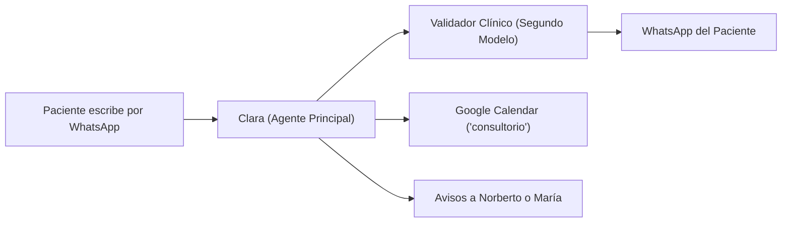

# 🌿 Manual de Clara: La Asistente y Secretaria Virtual de Kinésica
### Guía práctica y operativa del consultorio

> **¿Qué es este documento?**  
> Una explicación simple y clara de cómo funciona **Clara**, cómo atiende a los pacientes que escriben al WhatsApp del consultorio, cómo se organiza con la agenda de Google Calendar y cómo los profesionales del equipo pueden pedirle cosas directamente desde su propio celular.  
> 
> 🔗 **Enlace permanente en GitHub:** [https://github.com/MartinBrude/kinesica/blob/main/docs/manual-clara.md](https://github.com/MartinBrude/kinesica/blob/main/docs/manual-clara.md)  
> 📱 **Cuenta de WhatsApp de Clara:** [Ver paso a paso](cuenta-whatsapp-clara.md) ([Enlace en GitHub](https://github.com/MartinBrude/kinesica/blob/main/docs/cuenta-whatsapp-clara.md))  
> 🧪 **Guía Oficial de Pruebas y Casos de Uso:** [Ver Guía de Pruebas](guia-pruebas.md) ([Enlace en GitHub](https://github.com/MartinBrude/kinesica/blob/main/docs/guia-pruebas.md))  
> *(Este enlace se actualiza automáticamente con cada mejora del sistema).*

---

## 👩‍💼 1. ¿Quién es Clara y cuál es su trabajo?

**Clara** es la secretaria de recepción virtual de **Kinésica** (Palermo, CABA). Está conectada al WhatsApp del consultorio las **24 horas del día, los 7 días de la semana**.

### Sus responsabilidades principales:
1. **Atender al instante:** Da una primera respuesta educada y profesional en segundos, evitando que los pacientes queden esperando o se vayan a otro consultorio.
2. **Entender texto y audios de voz:** Si un paciente prefiere mandar un mensaje de voz contando su dolencia en lugar de escribir, Clara escucha el audio de forma invisible, comprende el problema y le responde por escrito con total naturalidad.
3. **Coordinar la agenda:** Ofrece horarios disponibles de lunes a viernes y anota automáticamente los turnos y llamadas en el Google Calendar (`consultorio`).
4. **Cuidar el tiempo de los profesionales:** Filtra preguntas repetitivas (dónde queda, horarios, cómo se abona, reintegros) y solo le avisa a Norberto al celular cuando hay un turno nuevo, un cambio o una consulta médica puntual.

---

## 🩺 2. ¿Cómo habla y cómo atiende a los pacientes?

Clara fue configurada con el estilo de una **secretaria médica real de Buenos Aires**: educada, cálida, ubicada, sobria y ejecutiva. Habla de "vos", escribe mensajes cortitos (2 a 3 oraciones para no cansar al que lee) y usa emojis con mucha moderación (🌿, 🩺, 🙌).

### Sus "Reglas de Oro":

* **Empatía ante el dolor:** Si alguien escribe diciendo *"me caí de la bici y me duele mucho la rodilla"* o *"tengo una contractura insoportable"*, Clara no le tira los turnos en seco. Primero valida su situación con calidez (*"Qué macana el golpe, para eso te va a venir muy bien la evaluación previa..."*) y luego propone los pasos a seguir.
* **Quiénes atienden:** Clara sabe que los profesionales del consultorio son el **Lic. Norberto Brude** y la **Lic. María Gulín**, pero **solo los nombra si el paciente pregunta expresamente** (*"¿Quién me va a atender?"*). No repite los nombres si no viene al caso.
* **Precios y aranceles (Cero números por chat):** Clara **nunca** da valores numéricos ni presupuestos por mensaje. Explica que el valor exacto de la sesión lo informa directamente el kinesiólogo durante la llamada previa de orientación de 15 minutos, según lo que cada persona necesite tratar.
* **Obras sociales y prepagas:** Si el paciente pregunta si atienden por OSDE, Swiss Medical, etc., Clara aclara amablemente que se atiende de forma particular para brindar sesiones exclusivas y personalizadas, y que al finalizar se entrega factura oficial para tramitar el reintegro. Si el paciente no pregunta sobre prepagas, Clara no lo menciona.
* **Dirección exacta, Google Maps y Transporte Público:** Informa la dirección (`Charcas 3889, Piso 5º, Dpto B, Palermo`), el enlace oficial de Google Maps ([https://maps.app.goo.gl/urpkh4HYe7dSdjPS9](https://maps.app.goo.gl/urpkh4HYe7dSdjPS9)) y las referencias clave de transporte (a 2 cuadras de Av. Santa Fe, Estación Scalabrini Ortiz del Subte D y Jardín Botánico) al confirmar turno presencial, si lo preguntan o si envían una ubicación por WhatsApp.
* **Fines de semana y feriados cerrados:** Atiende consultas las 24 horas, pero **solo otorga turnos de lunes a viernes hábiles**. Sábados, domingos y feriados nacionales de Argentina el consultorio permanece cerrado y Clara jamás ofrece ni agenda en esos días.
* **Sentido común de traslado (turnos para hoy):** Si un paciente escribe pidiendo turno para "hoy", Clara nunca le ofrece un horario que ocurra dentro de los próximos 90 a 120 minutos, para darle tiempo razonable de viajar y llegar tranquilo a Palermo.
* **Memoria histórica y reconocimiento automático (Efecto "Wow"):** Clara reconoce automáticamente a los pacientes habituales por su historial. Cuando alguien que ya se atendió en Kinésica vuelve a escribir, Clara lo recibe de forma personalizada (*"¡Hola [Nombre]! Qué bueno tenerte en contacto de nuevo 🙌"*), saltea automáticamente la llamada previa de orientación de 15 minutos y ofrece directamente turnos presenciales de 1 hora.
* **Indumentaria para la sesión (solo si el paciente pregunta):** Si el paciente consulta cómo vestir o qué ropa llevar, Clara responde exactamente con la pauta oficial del consultorio: varones con ropa interior o pantalón corto; mujeres con ropa interior, malla de 2 piezas o calza corta (para permitir una evaluación postural y de movilidad óptima).
* **Recepción y reenvío de archivos adjuntos (fotos y PDFs):** Si un paciente envía fotos de órdenes médicas, estudios, radiografías o comprobantes de pago, Clara acusa recibo al instante y se lo reenvía a Norberto con todo el contexto del paciente.
* **Contacto personal con Norberto o María:** Si un paciente pide hablar personalmente con Norberto o con María, Clara le avisa con calidez que el profesional respectivo se contactará a la brevedad y le dispara la alerta por WhatsApp directamente a esa persona (`+54 11 6156-4311` o `11 2853-1224`).
* **Privacidad estricta:** Clara jamás revela nombres ni horarios de otros pacientes. Si alguien pregunta *"¿a qué hora tiene turno mi marido?"* o *"¿quién está a las 16 hs?"*, Clara responde con firmeza profesional que por confidencialidad médica no puede brindar datos de terceros.

### 🛡️ El Validador de Calidad en Tiempo Real (Doble Modelo / Guardrail):
Antes de que cualquier mensaje salga hacia el WhatsApp del paciente, la propuesta de respuesta pasa automáticamente por un **segundo modelo de inteligencia artificial (Auditor Clínico)**. Este segundo modelo revisa en milisegundos que se cumplan todas las reglas médicas y de estilo:
1. Verifica que **no se mencionen precios numéricos** por chat.
2. Verifica que **no se pida llegar antes** de la sesión.
3. Verifica la **privacidad total** de otros pacientes.
4. Pule el tono para que sea siempre sobrio, empático y profesional.  
*Si detecta cualquier desvío, el validador corrige y limpia la respuesta antes de enviarla, asegurando una atención 100% segura y confiable.*

---

## 📅 3. ¿Cómo se conecta con la Agenda de Google Calendar?

Clara lee y escribe en tiempo real en el calendario **`consultorio`** de Norberto:

### Tipos de citas que agenda:
1. **Llamadas telefónicas de orientación previa (15 minutos):**  
   Aparecen en el calendario como: `📞 [LLAMADA 15m] Nombre Paciente`  
   Sirven para que el kinesiólogo converse brevemente con el paciente antes de que asista al consultorio.
2. **Turnos presenciales en consultorio (1 hora / 60 minutos):**  
   Aparecen en el calendario como: `🩺 [TURNO] Nombre Paciente`  
   Si es para un hijo o menor de edad, Clara registra: `🩺 [TURNO - MENOR] Nombre Menor (Familiar: Nombre)` y recuerda que deben venir acompañados por un adulto.
3. **Datos de contacto en cada cita:**  
   Al tocar cualquier evento en Google Calendar, en la descripción siempre figura el teléfono con el enlace de WhatsApp listo para tocar y escribirle al paciente.

### Cambios, cancelaciones y confirmaciones:
* **Si el paciente confirma su turno (cierre de recordatorios):** Cuando el paciente responde *"Confirmo"*, *"Sí, voy"* o *"Ahí estaré"*, Clara actualiza automáticamente el título del evento en Google Calendar agregando `[CONFIRMADO]` (ej: `🩺 [CONFIRMADO] Lucas Méndez`). Esto permite ver en el calendario qué pacientes del día ya confirmaron asistencia.
* **Si el paciente pide cambiar de horario:** Clara busca su turno anterior en Google Calendar y lo mueve al nuevo horario acordado (no crea duplicados).
* **Si el paciente cancela:** Clara lo elimina de la agenda, liberando el espacio para otra persona.

### ⏰ Recordatorios automáticos (24h previas) y Regla de Oro del Calendario:
El sistema envía recordatorios automáticos por WhatsApp a los pacientes con citas al día siguiente (a las 10:00 AM hora de Argentina).

> [!IMPORTANT]
> **El calendario es la única fuente de información:**  
> Antes de enviar un recordatorio, el sistema verifica obligatoriamente el estado de la cita en Google Calendar:
> * Si por algún motivo la cita **fue anulada o cancelada por Norberto, María o Clara en otro momento** (ya sea porque el evento fue eliminado de Google Calendar, o porque figura en título o descripción como `[ANULADO]`, `[CANCELADO]`, `[SUSPENDIDO]`, `[BAJA]`, etc.), **el recordatorio NO se envía bajo ninguna circunstancia**.
> * Los bloqueos de horario (`🚫 [BLOQUEADO]`), recesos de vacaciones (`🏖️ [VACACIONES]`), feriados y pacientes en lista de espera (`⏳ [LISTA DE ESPERA]`) quedan automáticamente excluidos de los recordatorios.
> * No se asume la vigencia de ninguna cita por chats previos: si no está activa en el calendario, no hay recordatorio.

---

## 🔔 4. ¿Qué notificaciones le llegan a Norberto y a María a su celular?

Para no llenarle el WhatsApp de mensajes innecesarios, **Clara no avisa cuando un paciente solo hace preguntas informativas**.

**Solo envía una alerta automática cuando hay algo importante que requiere atención:**

1. 📌 **Nuevo turno o llamada confirmada:**  
   > *📌 NUEVO TURNO / LLAMADA EN KINÉSICA*  
   > • *Paciente:* Lucas Méndez  
   > • *WhatsApp:* wa.me/54911...  
   > • *Mensaje:* "Quería un turno para este jueves a las 16 hs"  
   > • *Respuesta de Clara:* "Te esperamos este jueves a las 16:00 hs..."
2. 🔄 **Turno reprogramado:**  
   Avisa si un paciente movió su cita a otro día u horario.
3. 🚨 **Cancelación urgente del mismo día:**  
   Si alguien avisa a último momento que no puede ir a su turno de hoy, Clara dispara una alerta prioritaria avisando que **se liberó un hueco para hoy** e indica si hay alguien en lista de espera disponible para ocuparlo.
4. ⚠️ **Consultas personales y derivaciones (Norberto o María):**  
   - Si un paciente pide hablar personalmente con **Norberto** (o plantea un caso médico complejo / consulta general), Clara le avisa al paciente que Norberto se contactará con él/ella a la brevedad y le pasa el mensaje completo a **Norberto (`+54 11 6156-4311`)**.
   - Si un paciente pide hablar personalmente con **María** (Lic. María Gulín), Clara le avisa al paciente que María se contactará con él/ella a la brevedad y le dispara la alerta por WhatsApp directamente a **María (`11 2853-1224`)**.
   - Si piden hablar con ambos (*"con Norberto o María"*), la alerta le llega a los dos profesionales simultáneamente.
5. 📎 **Archivos adjuntos (estudios médicos, órdenes o comprobantes):**  
   Cuando un paciente manda una foto o PDF, Clara acusa recibo y le envía a Norberto una alerta inmediata con el nombre, mensaje, tipo de archivo y el enlace directo `wa.me/...` para abrir el chat del paciente y ver o descargar el original con un solo toque.

*(En todos los avisos, Norberto y María pueden presionar directamente el enlace azul `wa.me/...` para escribirle o llamarlo con un solo toque).*

---

## 👑 5. El "Modo Administrador": ¿Cómo le hablan los profesionales a Clara?

Clara reconoce automáticamente los celulares del equipo profesional:
* Celular de Norberto: `+54 11 6156-4311`
* Celulares de María: `11 2853-1224` y `+54 9 2236 80-7252`

Cuando alguno de los dos le escribe a Clara, ella los saluda por su nombre (*"Hola Norberto..."* o *"Hola María..."*) y se pone a su disposición con comandos muy sencillos:

### 📋 A. Ver los turnos del día
* **Qué escribirle:** `"agenda hoy"`, `"turnos de hoy"`, `"¿quién viene hoy?"` o `"agenda mañana"`.
* **Qué hace Clara:** Abre Google Calendar y les manda la lista ordenada de pacientes, con horarios, tipo de sesión y teléfonos.

### 🚫 B. Bloquear un horario para no atender
* **Qué escribirle:** `"bloquear jueves de 16 a 18"`, `"bloqueame mañana de 14 a 15:30"` o `"el martes a la mañana no atiendo"`.
* **Qué hace Clara:** Crea en Google Calendar un evento llamado `🚫 [BLOQUEADO] Horario no disponible`. A partir de ese momento, si un paciente pide turno en ese horario, Clara le dirá que está ocupado y ofrecerá otros huecos.

### 🏖️ C. Vacaciones o receso del consultorio
* **Qué escribirle:** `"vacaciones del 15 al 25 de octubre, cerrá la agenda"`.
* **Qué hace Clara:** Marca en el calendario `🏖️ [VACACIONES CONSULTORIO - CERRADO]` cubriendo todos esos días. Si un paciente escribe en ese período pidiendo turno, Clara le explica con amabilidad que el consultorio se encuentra en receso y le ofrece agendar un turno para cuando regresen.

### ⏸️ D. Atender el chat personalmente (Pausar a Clara)
* **Qué escribirle:** `"pausar bot"`, `"lo atiendo yo"` o `"silencio"`.
* **Qué hace Clara:** Responde *"Entendido [Norberto/María], pausado. Te dejo la conversación a vos 🙌"* y deja de intervenir en la conversación para que puedan chatear directamente.

### ❌ E. Anular o cancelar un turno de un paciente
* **Qué escribirle:** `"cancelá el turno de Lucas Méndez"`, `"anulá la cita de mañana a las 16 hs"`.
* **Qué hace Clara:** Busca la cita en Google Calendar y la elimina de la agenda, liberando el lugar y asegurando que no se dispare ningún recordatorio para ese turno.

*(Las acciones que piden Norberto o María no generan auto-alertas molestas).*

---

## ⏳ 6. Lista de Espera Inteligente (Smart Waitlist)

¿Qué pasa cuando un paciente quiere turno para un día que ya está completo?
1. Clara le explica que los horarios de ese día ya están cubiertos y le ofrece:  
   *"Si querés, te anoto en lista de espera y si se libera un hueco te aviso primero 🙌"*.
2. Si el paciente dice que sí, Clara lo anota en Google Calendar como `⏳ [LISTA DE ESPERA] Nombre Paciente` y le avisa a Norberto.
3. Si más adelante otro paciente cancela su turno de ese día, Clara le avisa a Norberto:  
   > *🚨 CANCELACIÓN URGENTE DE HOY EN KINÉSICA*  
   > • *Se liberó un hueco a las 16 hs.*  
   > • 💡 *PACIENTE EN LISTA DE ESPERA DISPONIBLE:* Lucas Méndez (wa.me/54911...).  
   > *¡Podés tocar su enlace para avisarle del lugar liberado!*

---

## 🧪 7. ¿Cómo probar a Clara desde el celular?

Para probar el funcionamiento como si fueras un paciente nuevo:

1. Abrí el chat de WhatsApp con el número de prueba de Clara.
2. Escribí el comando:  
   `/restart`
3. **Qué pasará:** Clara borrará la memoria de la conversación anterior y te saludará presentándose por primera vez:  
   *"Hola, buen día. Soy Clara de Kinésica. ¿En qué te puedo ayudar? 🩺"*
4. A partir de ahí podés probar pedirle un turno, preguntarle por prepagas, mandarle un audio de voz o pedirle cambiar la hora para ver cómo reacciona.

> 📋 **¿Querés probar escenarios específicos o reportar observaciones?**  
> En la [**Guía Oficial de Pruebas y Reporte de Feedback**](guia-pruebas.md) ([Enlace en GitHub](https://github.com/MartinBrude/kinesica/blob/main/docs/guia-pruebas.md)) tenés más de 30 casos de prueba preparados (consultas de prepagas, urgencias, audios confusos, lista de espera, etc.) y una ficha simple para reportar cualquier comentario o sugerencia.

---

## 📌 8. "Machete" rápido de comandos para los profesionales

Guardá esta tablita a mano para usar con Clara en el chat:

| Qué querés hacer | Qué tenés que escribirle a Clara |
|---|---|
| **Ver la agenda de hoy** | `"agenda hoy"` o `"turnos de hoy"` |
| **Ver la agenda de mañana o de otro día** | `"agenda mañana"` o `"agenda del viernes"` |
| **Cerrar un hueco específico** | `"bloquear jueves de 16 a 18"` |
| **Cerrar por vacaciones** | `"vacaciones del 15 al 25 de octubre"` |
| **Anular o cancelar el turno de un paciente** | `"cancelá el turno de Lucas"` o `"anulá la cita de las 16"` |
| **Hablar vos con un paciente sin que Clara responda** | `"pausar bot"` o `"lo atiendo yo"` |
| **Empezar una prueba de cero como paciente** | `/restart` |

---

*Cualquier sugerencia, ajuste de palabras o cambio en las reglas de atención que se quiera hacer, se puede ajustar en cuestión de minutos.*
